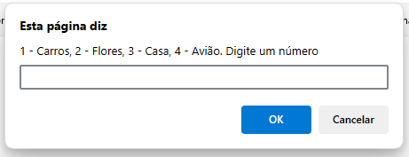
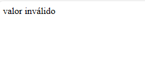
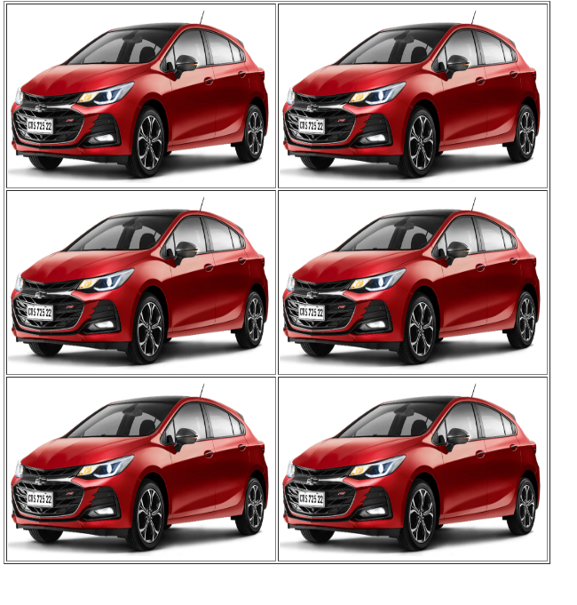
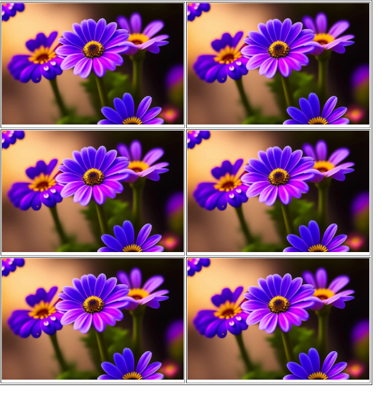
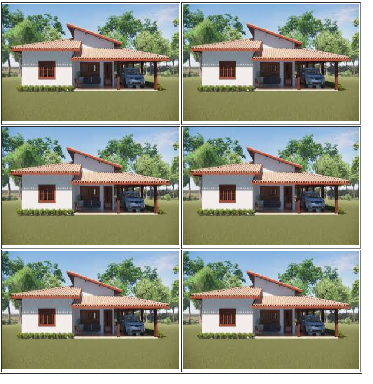

# js-FORrepeticaoDeImagem
um sistema com javascript simples para repetir imagens um tanto de vezes ao clicar num botão.
  

  <h3>Primeiro o prompt pede um número.</h3>
  

  

  <h3>Se não digitar nada, dá isso.</h3>
  

  

  <h3>Se digitar, repete as imagens do número.</h3>
  

